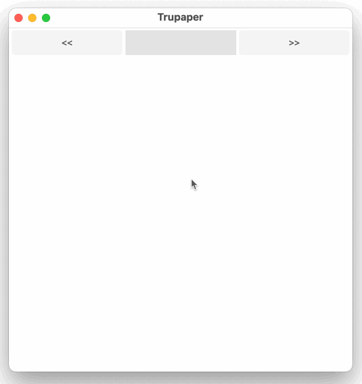

# Trupaper
Drawing on true paper

Trupaper is a small project to draw on a canvas of 500x500 pixels, it uses Fyne as a GUI library: which is a cross platform GUI library written in Go that works on Mobile, Desktop and Web. 

You can draw on the canvas with the mouse: whenever the left mouse button is pressed, the drawing starts: a collection of lines is created and added to the drawing.

The lines collection is sent to an *Immudb vault* server account through a REST call, if the saving is successful, the lines collection is added to another canvas and drawn in red color to show that that part is now NON mutable

Since every line drawn is directly saved in the remote Immudb vault server, upon start the app will retrieve all the lines collections saved in the vault and draw them on the canvas to allow the user to restart from the last saved state.

## Additional features
Two buttons, just named "Left" and "Right", allow to browse the history of the drawing while querying the Immudb vault server for the lines collections saved in the vault at the various stages of the drawing.
Whenever the user starts drawing again, the history is reset to the "present".



# Configuration
The application requires a simple `.env` file in the root folder of the project with the following content:
```bash
API_KEY=Immudb vault API Read/Write key
```

# Installation
the only requirement is to have Go installed on your machine, then you can run the following command to build and run the application
```bash
go build .
./trupaper 
```


# References
- Immudb: https://immudb.io/
- Fyne: https://fyne.io/
